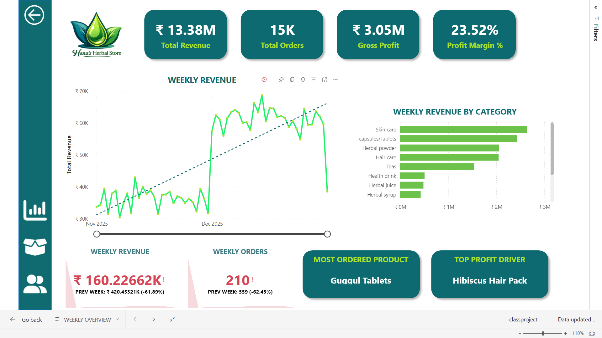
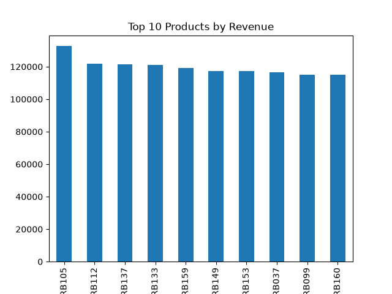
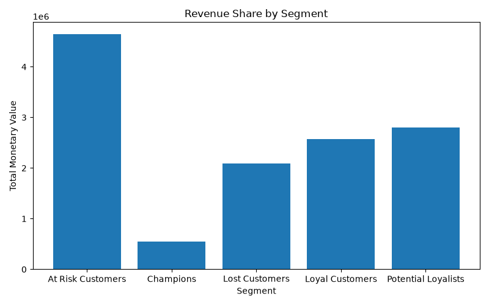
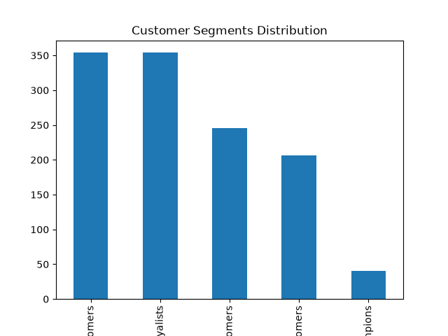
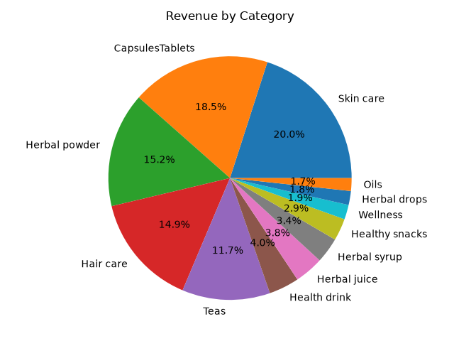

# 🌿 Herbal Store Analytics
### BUSINESS NAME - Hana's Herbal store
### Sales Overview | Product Intelligence | Customer Segmentation | Power BI • Python • Pandas • Scikit-learn 

  
  
  
  

# 📌 Overview

Hana’s Herbal Store is an offline retailer specializing in herbal and Ayurvedic products. Despite generating a high volume of transactional data, the business lacks structured analytics to support data-driven decision-making.

Currently, sales and inventory decisions are made without insights into customer behavior, product performance, or demand trends, leading to inefficient inventory management and missed revenue opportunities.

---

The herbal eCommerce business generates large volumes of transactional data but lacks a centralized analytics solution to answer critical business questions such as:

- How are sales performing over time?
- Which products contribute the most revenue and profit?
- Which categories drive business growth?
- Who are the most valuable customers?
- Which customers are at risk of churn?
- How can marketing campaigns be targeted more effectively?

Without actionable insights, the business struggles to optimize inventory, marketing spend, customer retention, and revenue growth.

---

# 🎯 Objectives

The primary objectives of this project are to:

- Analyze overall sales performance
- Monitor business KPIs
- Identify high-performing products
- Evaluate category performance
- Understand customer purchasing behavior
- Segment customers using RFM Analysis
- Build an interactive dashboard for business users
- Generate actionable recommendations with clear instructions

---

# 📂 Dataset

The dataset contains historical eCommerce transactions including:

- Customer Information
- Order Details
- Product Information

---

# 🛠 Tech Stack

## Programming

- Python

## Libraries

- Pandas
- NumPy

## Machine Learning

- RFM churn Analysis - Logistic Regression

## Visualization

- Power BI
- Matplotlib

---

# 📈 Dashboard Reports

## 1️⃣ Sales Overview Dashboard

### Purpose

Provides a high-level view of business performance.

---

## 2️⃣ Product Intelligence Dashboard

### Purpose

Evaluate product and category performance.

---

## 3️⃣ Customer Segmentation Dashboard

### Purpose

Understand customer behavior and identify high-value customers.

---

# 💡 Key Business Insights

Examples of insights generated from the analysis:

- Identified products generating the highest revenue.
- 
- Discovered low-performing products affecting profitability.
- Found customer segments contributing most of the revenue.
- 
- Identified customers at risk of churn.
- 
- Identified catagory level revenue contribution
- 

---

# 🚀 Business Recommendations

Based on the analysis:

📖[Insights](reports/data_analysis_insights.docx)

---

# 📬 Contact

If you found this project useful, feel free to connect or provide feedback.

---

## ⭐ If you like this project, don't forget to star the repository!
